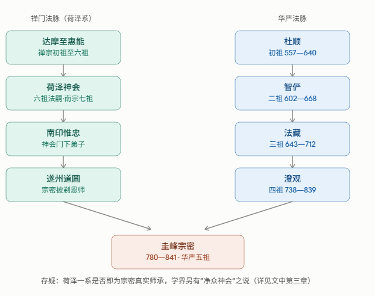

# 圭峰宗密：生平、传承、思想与文化史地位综合深度研究

> 研究说明：本文力求依据可回溯、可核验的资料展开——包括中国历代僧传碑铭、《大正藏》所收原典、以及中、日、韩、英、法多语种学术论著——对存在史料分歧或学界争议之处，一律以"存疑"标出，并尽量说明分歧双方的依据，不做无根据的裁断。凡属教内传承叙事（如法脉授受、悟道因缘等），因其性质本属信仰认信与内部认定，不完全等同于可独立核实的历史事实，本文将同时呈现其教内自述与教外史学的观察角度，请读者自行体察、辨析。

---

## 前言

圭峰宗密（780—841）是中国佛教史上一位极特殊的枢纽性人物：他既是华严宗被追认的"第五祖"，又是禅宗荷泽系的重要传人；他既是严谨的经论注疏家，又是最早系统整理禅门宗派谱系的"禅宗史家"；他既深研佛典，又主动与儒、道两家展开义理对话。近代以来，从胡适到冉云华，从镰田茂雄到葛雷戈里（Peter N. Gregory），从戴密微到卜睿德（Jeffrey Broughton），宗密研究已然成为一个横跨欧、亚、美三洲、汇聚多语种史料与方法论的国际性学术领域。本文即尝试在这一全球学术脉络中，对宗密其人、其学、其传承及其身后八百余年华严宗之流变，作一次尽可能全面而审慎的梳理。

---

## 一、全球多语言背景下的学术研究成果

### 1.1 中文学界

现代中文学界对宗密的研究，冉云华（加拿大麦克马斯特大学宗教学系教授，印度国际大学哲学博士）是绕不开的奠基性人物。据学界回顾文章记载，冉云华的宗密研究起点甚高：其第一篇宗密研究论文即是在法国汉学家戴密微（Paul Demiéville）的热情协助下发表的；1973年，他利用研究年假赴巴黎、伦敦、锡兰、日本访学一年，期间将宗密《禅源诸诠集都序》译为英文草稿，并与戴密微多次长谈，又在日本结识了正埋首于宗密研究的镰田茂雄。冉云华其后出版的《宗密》一书（台北东大图书公司"世界哲学家丛书"）即是这一国际学术网络的产物。冉云华提出一个颇具综括力的论点：中国佛教核心的"一心"思想，肇端于天台，经华严思想丰富补充，由澄观（738—839）确立雏形，最终由宗密（780—841）与延寿（904—976）完成定型——换言之，宗密在他的思想史叙事中，处于"中国佛教核心观念"定型链条的关键一环。

台湾及大陆学界另有麻天祥、董群、龚隽、王颂等学者，分别从思想史、判教理论、禅宗谱系建构、宋代华严学等角度展开专题研究；董群《融合的佛教：圭峰宗密的禅学与哲学思想》一类著作，系统梳理了宗密"禅教一致"说的哲学结构。**（存疑：因中文学术专著、期刊论文数量庞大且多未完全数字化，本文所举仅为可通过公开网络资料确认之代表性学者与著作方向，未能穷尽，具体篇目建议读者进一步查证中国知网、台湾华艺等数据库。）**

### 1.2 日文学界

日本学界的宗密研究体量宏大，堪称国际宗密研究的另一重镇。镰田茂雄（1927—2001）以《宗密教学の思想史的研究：中国華厳思想史の研究第二》（东京大学出版会，1975）一书奠定其学术地位——此书原为其博士论文，出版后获日本宗教学会赏（姉崎记念赏）。镰田另著有通俗性质的《华严の思想》（讲谈社学术文库），书中以专章分别讨论"华严与禅之融合——澄观"及"《圆觉经》之大研究者——宗密"，并旁涉新罗华严、日本华严的历史流变，显示出其研究视野之宽广。

日本学界另一项对本文议题极具价值的贡献，是对华严宗"祖统"叙事本身的批判性反思：据中文维基百科"华严宗"条目转述，境野黄洋考证认为，华严宗最初实际是由智正、智现、贤首（法藏）三代相传，杜顺被奉为"初祖"的说法乃后人所杜撰；铃木宗忠依据凤潭、觉洲之说，同样质疑杜顺的初祖地位，主张应以智俨为真正的宗派起源；宇井伯寿则提出智正—智俨—贤首三代说；唯独常盘大定支持传统说法，认为初祖确为杜顺，下传智俨、贤首。**这提示我们，即便是华严宗最基础的"谁是开山祖师"这一问题，在严格的文献考据之下也并非铁案，而是近代日本佛教学界持续辩论的课题**——这一点对理解宗密作为"第五祖"之地位的历史建构性质，具有方法论上的先导意义（详见第三章）。

### 1.3 英语学界

英语学界的宗密研究以葛雷戈里（Peter N. Gregory，美国史密斯学院宗教与东亚研究教授）与卜睿德（Jeffrey Broughton，加州州立大学长滩分校宗教学教授）二人的专著最具代表性与影响力。

葛雷戈里《宗密与佛教的中国化》（*Tsung-mi and the Sinification of Buddhism*，普林斯顿大学出版社，1991；夏威夷大学出版社再版）以宗密生平为经、以其判教思想为纬，被白瑞德（Robert E. Buswell, Jr.，加州大学洛杉矶分校）誉为"西方语言中出现过的最重要的中国佛教研究著作之一"。该书第二章将宗密生平精确划分为若干阶段（"儒学背景 780—804"、"禅修训练与《圆觉经》804—810"、"澄观与华严 810—816"、"早期著述 816—828"、"文人交游 828—835"、"甘露事件 835"、"晚年与身后 835—841"），后文第四章将部分参照此一分期。葛雷戈里全书后半部分尤重宗密对儒、道二家的批判性吸纳，并提出一个大胆而具启发性的论点：宗密对洪州禅"过激反礼教倾向"的批判，与两百余年后朱熹（1130—1200）对佛教（尤其是禅宗"作用是性"一类主张）的新儒学式批判之间，存在结构性的可比拟之处——葛雷戈里称之为二者共享的"问题意识"（common problematic）与"结构性平行"（structural parallels）。**需要说明的是，这是葛雷戈里本人提出的一项比较思想史论点，而非确凿的历史因果关系（朱熹并无证据直接读过宗密），学界对此说的解释力大小仍持保留态度，此处如实转述其论证，并非采信为定论。**同时，也有书评（如《宗教研究》相关书评）指出，葛雷戈里的研究方法偏重经录文献与教理谱系，对宗密所处时代的宗教实践（praxis）层面着墨较少，这一局限性亦当一并注明，以求持平。

卜睿德《宗密论禅》（*Zongmi on Chan*，哥伦比亚大学出版社，2009）首次将宗密代表作《禅源诸诠集都序》全文译为英文，并附译《禅诀》（宗密致弟子论洪州禅、荷泽禅优劣之书信）及《禅门师资承袭图》相关的"禅记"材料。此书对国际学界的一项重要贡献，是揭示了宗密"以经解禅"路数在东亚佛教史上远比此前想象的更具主流性——据卜睿德考证，宗密的判教框架经由永明延寿（904—976）《宗镜录》的转述而在宋、明中国及高丽后期、镰仓室町日本广泛流传；更引人注目的是，西夏（唐古特）语译本的《禅源诸诠集都序》与《禅诫》，构成了西夏禅宗传统的直接文献基础——卜睿德称此为"一个前所未知的非汉族地区性禅宗支系，可直接追溯至圭峰禅法"。书评者福克斯（Alan Fox）亦指出，日本临济宗自江户时代以来，出于宗派"教外别传"叙事之需要，反而边缘化了宗密与延寿这一"以经证禅"的传统——**这说明宗密思想在东亚的历史影响力呈现出明显的"起伏"与"地域差异"，并非线性扩散，后文第五章将对此进一步展开。**

美国亚利桑那大学佛教研究中心主任吴疆（Jiang Wu）教授2021年的一场公开讲座，专门以裴休（791—864）这位"中晚唐道学追随者"的个案切入，讨论其与宗密、黄檗希运二位"最杰出"的佛教导师之关系，显示宗密及其周边人物研究在当代北美学界仍具活跃度。**（存疑：笔者未能检索到该讲座的正式出版物或论文全文，此处仅作为"该领域仍有持续研究活动"的旁证列出，不作更具体的内容转述。）**

### 1.4 法语学界与敦煌学传统

法国汉学在二十世纪对中国禅宗史、敦煌学的贡献举足轻重，其代表人物戴密微（Paul Demiéville，1894—1979，法兰西学院教授、法兰西学院院士）师从沙畹（Édouard Chavannes），是二战后法国汉学界的领军者，以敦煌写本研究与佛教研究选集著称。前述冉云华宗密研究的起步即得益于戴密微的直接扶持，这本身就是宗密研究"国际性"品格的一个具体例证。戴密微另一项与本文主题有间接但重要关联的贡献，是其基于敦煌藏文、汉文写本对"吐蕃僧诤"（拉萨法诤，约792—794年）的开创性研究（法文原著，后有英译本 *Debates of the Monks of Lhasa* 出版）——该事件涉及汉传禅宗"顿悟"说与印度中观学者莲花戒（Kamalaśīla）"渐修"立场之间的辩论。**须特别说明：宗密本人并未参与拉萨僧诤（发生时宗密尚是十余岁的少年，且远在四川、未曾入藏），二者没有直接的历史交集；但戴密微所开创的敦煌禅籍研究方法与史料基础，为后世学者理解宗密对北宗、牛头、洪州、荷泽诸家"顿渐"之辨的历史语境，提供了不可或缺的比较视野，这是一种间接而非直接的学术关联，行文中应避免混淆。**

### 1.5 朝鲜与日本学术脉络中的宗密

宗密思想在朝鲜半岛与日本的接受史，本身即构成一个重要的多语言研究议题，因材料主要以韩文、日文撰写和保存，将在第五章"域外传承"中作专门梳理，此处从略，仅指出：卜睿德在其书评回应中明言，学界"早已知晓"宗密透过高丽普照知讷（1158—1210）对朝鲜禅宗的深远影响；日本方面，镰仓时代华严宗"中兴之祖"明恵上人（高弁，1173—1232）及"华严十祖"说的提出者凝然（1240—1321），也都是绕不开的关键人物。

### 1.6 学术争议与存疑问题小结

综合上述多语种研究成果，可以初步归纳出若干仍存争议、需以"存疑"标注的核心问题，将在后续章节具体展开：

1. 宗密禅宗师承究竟属"荷泽神会"系统，抑或"净众神会"系统（胡适 vs. 冉云华之争，详见第三章）；
2. 华严宗"初祖杜顺"说的可靠性（境野黄洋、铃木宗忠、宇井伯寿 vs. 常盘大定之争）；
3. "华严五祖"谱系本身的成型时间与建构过程（详见第三章）；
4. 澄观生卒年及享寿（738—839？737—838？抑或如《宋高僧传》所暗示的元和年间即已示寂？详见第三章）；
5. 葛雷戈里"宗密—朱熹结构平行论"的解释力边界（本节已述）。

---

## 二、佛门内部、跨宗派与跨宗教视角

### 2.1 华严宗内部的定位与评价

在华严宗自身的叙事传统中，宗密被追认为"第五祖"，与杜顺、智俨、法藏、澄观并列，其地位在裴休所撰〈圭峰禅师碑铭〉、赞宁《宋高僧传》卷六、道原《景德传灯录》卷十三等基础文献中已获确立。宗密自身的著述立场十分明确：裴休为《禅源诸诠集都序》所作之序称，此书旨在"以如来三种教义，印禅宗三种法门，融瓶盘钗钏为一金，搅酥酪醍醐为一味"——即以"密意依性说相教""密意破相显性教""显示真心即性教"三种教相，分别对应禅门"息妄修心宗""泯绝无寄宗""直显心性宗"三宗，主张教、禅本非二途，仅因传授者各执一端、"以承禀为户牖，各自开张；以经论为干戈，互相攻击"，遂致宗派纷争、法义割裂。这一"教禅一致"的立场，可以说是宗密留给华严宗——乃至整个汉传佛教后期发展——最深远的方法论遗产（详见第五、六章）。

### 2.2 禅宗内部视角：荷泽宗人的定位与后世禅门的疏离

在禅宗内部，宗密因其禅法师承（详见第三章）而被归入荷泽宗一系，中华典藏等资料径称其为"禅宗荷泽神会的四传弟子"。他本人在《禅源诸诠集都序》及《圆觉经大疏钞》中，对当时并行的北宗（神秀系）、牛头宗（法融系）、洪州宗（马祖道一系）、荷泽宗（神会系）作了细致的义理分梳，并明确将荷泽一系判为最契合"显示真心即性教"、最能代表达摩"直指人心"本旨的一支——这一判摄本身即带有鲜明的宗派立场，卜睿德在其英译研究中即指出，宗密曾致信弟子（即《禅诀》一文），力陈荷泽禅优于当时声势正盛的洪州禅。

然而颇具历史反讽意味的是，晚唐以后禅宗主流的发展方向，恰恰是洪州系统下开出的临济、沩仰等"五家"逐渐主导天下丛林，而荷泽一系本身则日渐式微、传承断绝；与此同时，禅门"不立文字、教外别传"的自我定位日益强化，与宗密所极力主张的"经是佛语，禅是佛意，诸佛心口必不相违"的"教禅一致"立场形成了微妙的张力。卜睿德的研究进一步指出，日本临济宗自江户时代起，出于强化"教外别传"宗派认同的需要，实际上将宗密《禅源诸诠集都序》一类"以经证禅"的文本传统边缘化处理，反倒是永明延寿《宗镜录》——一部深受宗密影响、篇幅浩瀚百卷的"复述"之作——在曹洞、法眼等宗内长期流传、影响不绝。这提示我们：**宗密在禅宗内部的历史评价并非铁板一块，而是随宗派、时代、地域的不同而呈现相当大的落差**，这一点在讨论其"历史地位"时应予以充分正视，而非简单地以教内后设的"祖师"身份一言以蔽之。

### 2.3 天台宗视角：山家山外之争的间接映照

天台宗对宗密所代表的"华严禅"式融合路线，态度较为复杂，且集中体现在天台宗内部一场影响深远的思想论争之中。北宋初年，天台宗因对《金光明经玄义》广本、略本真伪的争议，分裂为"山家""山外"两派：山外派以孤山智圆、梵天庆昭为代表，活动中心在钱塘（杭州），其学说倾向于"真心观境"，即以一超越、清净的"真心"为观法根本、不完全承认"事造三千"之说，这一进路与华严宗"性起"思想、乃至宗密"本觉真心"的立场有相当的亲缘性；山家派以四明知礼为首，活动中心在四明（宁波），力主恢复智𫖮、湛然"妄心观境"、彻底"事理三千皆具"的天台本宗立场，与山外派往复辩难、著书立说，最终山家一系取得正统地位，山外一脉不久即告衰歇。

**这场发生在天台宗内部的"山家山外"之争，可以视为宗密"教禅一致""华严性起"思想向外辐射、在其他宗派内部激起回响与反弹的一个具体案例**——山外派某种程度上是天台宗内部消化、吸收华严式"真心"本体论的产物，而知礼领导的山家派的胜出，某种意义上正是天台宗对华严式融合路线的一次自觉抵御与自我边界的重新划定。就纯粹教理而言，天台、华严两宗对"圆教"的理解也确有实质分野：天台宗以"三谛圆融""一心三观""初住即具一切种智"为极则，强调"教观双美"；华严宗则以"理事圆融""事事无碍""主伴具足、帝网重重"为极则。学界有概括称"天台在教授上极圆，华严在教法上极圆"，即两宗各自在不同维度上宣称"圆满"，彼此立场难以简单化约、互相包摄——这一表述较为持平，本文采纳之，不做孰高孰低的价值判断。

### 2.4 儒家、道家视角：与韩愈的隐性对话及裴休等文人的融摄

宗密晚年代表作《原人论》，是宗密思想中与儒、道两家发生直接义理交锋的核心文本。全文约三千余字，结构谨严，分四部分：（一）"斥迷执"，针对"习儒道者"，批驳儒家"元气"说、道家"自然""道"生万物说不能究竟解释众生苦乐、贵贱、善恶之根源；（二）"斥偏浅"，针对佛教内部"不了义教"，依次批评人天教、小乘教、大乘法相教（唯识）、大乘破相教（中观／般若）诸家教义之局限；（三）"直显真源"，正面阐发"一乘显性教"（即华严所判"圆教"）"本觉真心"（如来藏自性清净心）之义；（四）"会通本末"，以"一乘显性教"为"本"，将此前所斥之儒、道及佛教诸"末教"重新会归于同一真源，"皆为正义"——即并非简单地否定儒道，而是在承认其现实功用（伦理教化、治国安邦）的前提下，将其安置于一个以佛教"了义"为终极依归的层级化整体之中。

值得注意的是一项文献学上的旁证：据传统文献《昌黎先生诗文年谱》记载，韩愈本人亦撰有一篇题为《原人》的短文（约二百余字，收入其"五原"——《原道》《原性》《原毁》《原鬼》《原人》），主张"天""地""人（及夷狄禽兽）"三者各有"为主之道"，人为"万物之灵"，"圣人一视而同仁，笃近而举远"。有学者据此篇的系年，推断宗密《原人论》的写作时间当在其后，并认为宗密之作在相当程度上正是针对韩愈《原人》一文所代表的中唐儒家排佛思路而发。**此说涉及古代文献系年考证，本文不作确证性转述，仅如实呈现学界据以推断"宗密—韩愈"之间可能存在直接义理对话关系的文献依据，供读者进一步查证。**无论这一具体的文本互动关系能否最终坐实，宗密与韩愈作为同时代（韩愈768—824，宗密780—841，二人活动时期高度重叠）分别代表佛、儒两大阵营、且都撰有同题短论的知识人，这一事实本身即颇具思想史的对照意义：一方以强硬姿态"人其人，火其书，庐其居"，欲彻底逐佛于中国思想之外；另一方则以更具包容性的层级化"判教"策略，试图将儒、道二家纳入一个以佛教为终极真理的整体秩序之中——两种截然不同的"多元处理"策略，恰构成了中唐思想史上一组极具张力的对照。

宗密与文人士大夫阶层的互动，也从另一个侧面反映出佛教与儒家士人世界的深度交融。其最重要的护法弟子裴休（791—864，一说卒于846，本文取通行的791—864说，并标注此处存在异说），后官至宰相，笃信佛教而"操守严正"，被唐宣宗誉为"真儒者"——这一称号本身即耐人寻味：一位官至宰相高位、深研佛理的士大夫，其人格被最高统治者以儒家道德语汇加以肯定，恰恰体现了中晚唐"三教合流"社会氛围下儒佛身份边界的模糊化。裴休为宗密撰写〈圭峰禅师碑铭〉、《原人论序》、《禅源诸诠序》，同时也为清凉澄观撰写〈清凉国师碑铭〉——他事实上是宗密与澄观身后声名得以确立、流传的最重要的文字守护者。然而裴休的佛教信仰版图并不限于华严—荷泽一系：他与洪州系统下、日后被视为临济宗先驱的黄檗希运禅师亦有"殊胜因缘"，曾两度延请黄檗于钟陵、宛陵开示，日夜问法、笔录其言论为《黄檗山断际禅师传心法要》，并亲自作序。**这一细节颇具启发性：宗密本人在其判教体系中对洪州禅评价并不高（甚至有所批判），但其最重要的门人裴休却同时深度归信洪州一系传人黄檗希运——这说明中晚唐士大夫阶层的佛教信仰实践，往往比僧团内部严格的宗派判摄更具流动性与包容性，个人的法缘往往超越了教理体系的门户之见。**

大诗人白居易（772—846）与宗密同样交谊深厚，据学者考订，白居易曾作〈赠草堂宗密上人〉一诗相赠，诗中盛赞其"道与佛相应"、弘法不辍的德行。但白居易本人正式承认的禅门传承，据《传法正宗记》记载，却是"大鉴（惠能）之四世"洛京佛光寺如满禅师一系，而非宗密所属的荷泽系；且据学者考证，白居易一生先后与北宗、牛头宗、荷泽宗、洪州宗四家禅法都有过深入接触，融会诸家、不专一门。这与裴休的情形如出一辙，再次印证了唐代文人士大夫在佛教诸宗之间"广结善缘、转益多师"的普遍风气，与僧团内部相对严格的宗派认同形成对照。

### 2.5 藏传佛教与敦煌文献视角（审慎处理）

如第一章已述，宗密本人并未参与著名的"拉萨僧诤"（约792—794年，汉僧摩诃衍与印度中观论师莲花戒之间关于顿悟、渐修的辩论）——彼时宗密尚年幼，且远在蜀地，二者并无直接交集，这一点必须明确澄清，以避免以讹传讹。但宗密的著作与拉萨僧诤所涉及的"顿渐之争"确实共享着同一历史语境：八世纪末至九世纪初，"顿悟"与"渐修"孰是孰非，是汉传佛教内部（也部分透过吐蕃与汉地的佛教交流）持续发酵的核心议题，宗密对北宗（渐修）、荷泽（顿悟渐修并重）、洪州（触类是道、当下即真）、牛头（本无一法）诸家的细致判摄，可以理解为对这一时代性课题在汉地内部给出的一种系统性回应。法国敦煌学奠基者戴密微对拉萨僧诤的开创性研究，正是后世学者藉以理解这一更广阔历史语境的重要参照系（详见1.4节）。

另一项与藏传佛教关联较弱、但史料确凿的"跨语际"事实是：西夏（唐古特）作为一个深受汉传、藏传佛教双重影响的多元宗教文化体，其禅宗传统的核心文献之一，正是唐古特文译本的宗密《禅源诸诠集都序》与《禅诫》——卜睿德在其英译研究中明确指出，这构成了"直接可追溯至圭峰禅法"的一个此前不为学界所知的非汉族地域性禅宗支系（详见1.3节）。**这一文献学事实虽然不涉及藏传佛教主流的显密教法体系，但确凿显示宗密思想文本曾经跨越汉、藏文化圈之间的西夏这一特殊地带，具有货真价实的"多语言传播"意义。**

### 2.6 现代跨宗教对话与比较哲学视野中的宗密

在当代比较宗教学与跨宗教对话的语境下，宗密"教禅一致"及《原人论》"会通本末"的层级化判教方法论，因其"既不简单否定他者、又不放弃自身终极立场"的独特结构，近年愈发受到比较哲学与宗教对话研究者的关注，常被援引为古代思想家处理"宗教多元主义"（religious pluralism）问题的一个本土范例，与现代宗教哲学中"包容主义"（inclusivism，如卡尔·拉纳〔Karl Rahner〕"匿名基督徒"说）等立场形成跨文化的类比与对话。**（存疑：此类比较研究散见于各类跨宗教对话论文集及比较哲学期刊，因材料较为分散、且高度依赖具体作者的诠释框架，本文仅指出这一研究方向的存在及其大致理路，不做具体篇目的确证性征引，读者如有兴趣可循"Zongmi religious pluralism inclusivism"等关键词进一步检索。）**

---

## 三、宗密与澄观：师承脉络，以及更早祖师的传承过程

### 3.1 "华严五祖"谱系：一个层累建构的历史产物

在展开宗密与澄观的师承关系之前，有必要首先澄清一个常被忽视的方法论前提：**"华严宗五祖"（杜顺—智俨—法藏—澄观—宗密）这一谱系，并非唐代当时便已定型、如禅宗"衣钵相传"般清晰的制度性传承，而是历经宋、清乃至日本镰仓时代学者层层建构、修订而成的历史产物。**

现存证据显示，这一谱系的成型经历了至少以下几个阶段：

- **宋代雏形**：北宋华严"中兴教主"净源（1011—1088）厘定了"华梵七祖"谱系，在杜顺、智俨、法藏、澄观、宗密五人之前，追加马鸣、龙树二位印度论师，合称"华严七祖"；
- **日本的进一步扩展**：镰仓时代日本华严宗学僧凝然（1240—1321）在七祖之前再追加普贤、文殊二位菩萨及世亲论师，构成"华严十祖"说；
- **清代的系统整理**：清康熙十九年（1680），华严学僧续法应居士戴京曾之请，辑成《法界宗五祖略记》一卷，将杜顺、智俨、法藏、澄观、宗密五人合传，正式以"五祖"之名系统化、定型化。值得注意的是，据《法界宗五祖略记》词条介绍，续法此书在若干具体史实上"与唐、宋时期的史料记载不尽相同"——例如否定了法藏于武周万岁通天元年（696）讲新译《华严经》并受具足戒的传统说法，改订为上元元年（674）受戒；又将传统归于杜顺名下的《妄尽还源观》改判为法藏所撰。这说明**即便是这部奠定"五祖"称谓的权威文献本身，也是一部带有相当程度"考订""重构"性质的晚出之作，而非对唐代原始史料的单纯汇编**；
- **现代日本学界的再质疑**：如第一章1.2节所述，二十世纪日本学者境野黄洋、铃木宗忠、宇井伯寿等人，更从根本上质疑了"杜顺为初祖"这一说法本身的史料依据，唯常盘大定坚持传统说法。

**因此，本文在使用"华严五祖""第五祖"等表述时，应被理解为一种历经千年层累而成、为教内外普遍接受和使用的"标准化叙事框架"，而非意味着唐代当时即存在一个自我标榜为"华严宗第五代掌门"的制度性头衔。**这一澄清并非要否定宗密在华严思想史上的实际地位与贡献（这一点有其独立、坚实的文献与思想史证据支撑，详见第六章），而是为了将"历史事实层面的师承关系"与"后世教内谱系建构"这两个不同性质的问题清晰地区分开来，这正是宗密研究领域内一项基础而重要的方法论自觉。

### 3.2 杜顺与智俨：更早祖师传承小传

**杜顺（法顺，557—640）**，陈武帝永定元年生，雍州万年（今陕西境内）人，俗姓杜。十八岁于因圣寺依僧珍禅师出家，时人尊称"炖煌菩萨"。因久居终南山，故称"终南法顺"。唐贞观十四年（640）圆寂于义善寺，塔建于长安南华严寺，唐太宗尊称其为"帝心尊者"。传世重要著作有《华严五教止观》一卷、《华严法界观门》一卷，后者尤为重要——正是这部观法著作，数百年后经道圆禅师之手传授给了年轻的宗密（详见3.4节），构成了一条清晰可考的文本传承线索。杜顺门下弟子中，以智俨最为知名。

**智俨（602—668）**，隋文帝仁寿二年生，天水（今甘肃）人，别号"至相大师""云华尊者"。十二岁随杜顺至终南山至相寺，两年后剃度，其后师事法常法师听讲《摄大乘论》，又于智正门下修学《华严经》。主要著作有《华严经搜玄记》《华严经内章门孔目章》《华严五十要问答》《华严一乘十玄门》等，"十玄门"说即华严宗最具标志性的"法界缘起"理论架构之滥觞。智俨门下弟子中，法藏（后世尊为"贤首国师"，华严宗实际的理论集大成者）与义湘（新罗僧人，返国后开创朝鲜半岛华严宗，是为"海东华严初祖"）二人尤为关键——**义湘作为智俨的直传弟子，早在法藏、澄观、宗密之前，便已将华严教法独立传入朝鲜半岛，这意味着朝鲜半岛华严宗（화엄종）最初的法脉源头，实际上与宗密并无直接关系，宗密对朝鲜半岛佛教的影响是后世（十二、十三世纪，透过知讷）以另一种方式、经由文本而非法脉授受重新建立的（详见第五章5.7节）。**

法藏（643—712）作为"三祖"，历经唐高宗、武后、中宗、睿宗、玄宗五朝，备受礼遇，著《华严经探玄记》《华严一乘教义分齐章》（即《五教章》）等奠基性著作，正式确立了华严宗"小、始、终、顿、圆"五教判摄体系，是华严宗教理系统真正意义上的集大成者，故华严宗又称"贤首宗"。

### 3.3 澄观：驳杂广学的求法历程与帝王眷顾

**澄观（约737/738—838/839，生卒年学界存在异说，详见后文）**，字大休，俗姓夏侯（一说姓戴），越州山阴（今浙江绍兴）人，世称"清凉国师""华严菩萨""华严疏主"。其求法履历之广博，在唐代高僧中亦属罕见：十一岁于本州宝林寺霈禅师座下出家；至德二年（757）从常照禅师受具足戒；其后先后从醴律师学相部律、从昙一律师学南山律、从玄璧法师学"三论"（关河三论学）；大历元年（766）于瓦官寺听受《大乘起信论》《涅槃经》，并从法藏（此法藏非贤首国师，乃另一同名僧人）研习新罗元晓所撰《大乘起信论疏义》；又赴钱塘天竺寺从法诜（贤首法藏再传弟子慧苑之门人）复习华严；大历十年，更赴苏州从荆溪湛然（天台宗第九祖）咨受天台"止观"与《法华》《维摩》诸经疏义，同时参谒牛头山慧忠、径山道钦二位牛头宗禅师，并两度参访洛阳无名禅师（融摄北宗华严与荷泽南宗）与慧云禅师（专精北宗禅理）。**据此履历，澄观本人在正式收授宗密之前，早已是一位广泛贯通律、禅（南北二宗兼牛头宗）、三论、天台、华严诸家，且深谙"外学"（经史子集、天竺悉昙、因明五明等）的百科全书式学问僧——这一点对理解宗密日后"教禅一致"的综合性思想倾向具有重要的师承渊源意义：宗密的融摄性格，某种程度上正是承继、发扬了其师澄观本已具备的跨宗派学养。**

澄观一生撰有《华严经疏》等著述四百余卷，讲《华严经》达五十遍：兴元元年（784）至贞元三年（787），历时四年撰成二十卷本《大方广佛华严经疏》；贞元十二年（796）奉诏入京协助般若三藏翻译《四十华严》，译成后又撰《贞元新译华严经疏》十卷；贞元十五年（799），因德宗寿诞入内殿讲《华严经》，获赐"清凉国师"号；此后历顺宗、宪宗、穆宗、敬宗、文宗诸朝，元和五年（810）宪宗敕铸金印，号"僧统清凉国师"，统领天下僧众；开成元年（836）文宗再加封"大统国师"。

**关于澄观生卒年，史料存在明显分歧，此处必须专门"存疑"说明**：《佛祖历代通载》《佛祖统纪》系统记载其生于开元二十五、六年（737/738），圆寂于开成三年（838）；《释门正统》则记为圆寂于开成二年（837）；而《宋高僧传》却记载"以元和年卒，春秋七十余"——若依此说，澄观应卒于元和年间（806—820），寿七十余，这与前述享寿百余岁（甚至有资料称其"寿一百二岁"）的说法存在根本性的矛盾。学界普遍采信738—839（或737—838）说，本文亦从此通行说法，但读者应知晓《宋高僧传》记载的巨大出入，且百岁以上高龄这一说法本身，在中国佛教传记书写传统中亦常带有彰显"福德深厚、法身常住"的宗教修辞色彩，未必是纯然客观的人口学事实，宜审慎看待。

### 3.4 宗密与澄观的相遇：从法界观门到长安受学

宗密与澄观的师徒缘分，是经过一段颇为曲折、且极具"参学"色彩的过程才最终确立的，据《宋高僧传》卷六及诸传记综合，大致历程如下：

元和二年（807），二十八岁的宗密本欲赴京应试，途经遂州（今四川遂宁），于大云寺谒见道圆禅师，"言下相契应"，遂从其剃度出家，同年受具足戒（一说次年，即元和三年）。道圆授予宗密的，正是前述杜顺所撰《华严法界观门》，并令其"往各处参学"——这构成了宗密与华严教法最初的文本接触，且这一接触是经由禅宗荷泽系的道圆之手完成的，颇能体现中晚唐禅、教已然相互渗透的时代氛围。据道圆之嘱，宗密先赴益州圣寿寺参谒惟忠（南印）禅师，又受惟忠启示北上洛阳，参谒奉国寺神照禅师——于神照处，宗密首次系统接触华严经典。

其间还有一则广为传诵的"悟道因缘"：宗密某次随众僧应供，偶然得读《圆觉经》，"读罢有所体悟"，遂将所见陈述于道圆，得道圆印可，谓其应弘扬"圆顿之教"。这部《圆觉经》此后终其一生成为宗密用力最深、著述最多的一部经典（其相关注疏包括《圆觉经大疏》十二卷、《圆觉经大疏释义钞》十三卷、《圆觉经略疏》四卷等），葛雷戈里在其著作分期中即以"禅修训练与《圆觉经》（804—810）"为宗密早期思想形成的核心标签。

元和五年（810），宗密东下游历襄汉一带，于恢觉寺遇病中的灵峰禅师——灵峰乃澄观门人，将其师所著《华严经疏》及《随疏演义钞》相赠。宗密"日夜学习"，认为是稀有之作，遂修书长安，自称弟子，陈述心得，澄观回信，表示愿意相见。次年（元和六年，811），宗密正式启程赴长安拜谒澄观，"具以弟子之礼，在其门下修学两年"（一说"数年"，具体年限各资料略有出入）。此后宗密退隐终南山，先后驻锡智炬寺（元和十一年，816，阅藏三年）、草堂寺南圭峰兰若、丰德寺等地，专事著述、禅诵，"圭峰宗密"之号即由此而来。

**综合上述历程可见，宗密与澄观的相遇，并非始于一场直接的拜师仪式，而是经历了"道圆授法界观门→游历参学→偶得澄观疏钞、自学而心悦诚服→修书自称弟子→亲赴长安受学"这样一个相当独特的、以文本自学为先导的求法路径。**这一路径本身即颇具象征意义：宗密对华严教法的"皈依"，某种程度上是先透过阅读澄观的文字著述而在精神上完成的，其后的长安"亲炙"更多是对这一已然确立之义理认同的正式确认与深化。这也从一个侧面解释了，为何宗密虽在禅法传承上出身荷泽一系（详见3.5节），却能够如此彻底地将自身的思想认同、乃至"华严宗第五代传人"的身份，安顿在与澄观的师承关系之上。

### 3.5 宗密的双重师承：禅门荷泽系与华严澄观系——一桩学术公案

宗密身上实际同时承载着两条师承线索：一是经由道圆而上溯的**禅门法脉**，二是经由澄观而确立的**华严教理法脉**。前者在学术史上曾引发一桩颇具典范意义的考据公案，值得专门辨析。

据裴休〈圭峰定慧禅师传法碑〉的传统记载，宗密师承出自荷泽神会一系："自迦叶至达摩凡二十八世，达摩传可，可传璨，璨传信，信传忍……忍传能……"下续神会一系，宗密即属此荷泽法脉。然而，胡适根据宗密自撰《圆觉经略疏钞》及其在敦煌写本考据基础上提出的研究，得出了一个颠覆性的结论：宗密师承实际另有源头——出自成都净众寺一系（无相禅师所创"净众宗"），传承中确实存在一位"神会"，但此"神会"乃净众寺神会，并非声名更盛的荷泽神会，二者恰因同名而致后世混淆。

对此，冉云华提出了一个颇具调和性、同时保留了双方证据效力的解释：南印惟忠（宗密早年游历所参谒之禅师，见3.4节）确实曾先受法于荷泽神会，其后又转益于净众寺神会门下——换言之，惟忠本人身兼两支"神会"法脉的传承，这正是造成后世文献记载混淆的历史根源所在。冉云华据此支持将宗密仍归属于荷泽宗这一传统说法，但其论证方式本身已经充分吸收、回应了胡适基于敦煌文献的质疑，而非简单地重申传统碑传之说。

**这桩公案对本文的方法论意义在于：它生动示范了"教内传承认信"（裴休碑铭代表的传统说法）与"文献考据史学"（胡适基于敦煌写本的质疑）之间可能存在的张力，以及现代学术如何透过更细致的史料辨析（冉云华的调和方案）尝试弥合二者。**读者应知晓，这一问题在严格意义上尚不能说已有"定论"，本文采用"荷泽宗"这一表述时，是遵从冉云华论证之后学界较多采信的主流说法，但胡适提出的怀疑本身自有其坚实的文献依据，不应被视为已被彻底推翻的过时之论。

值得一提的是，宗密对自身法脉传承的自我意识也颇为强烈——据卜睿德英译研究转引，宗密曾在著作中自陈："吾何幸能忝为释迦如来第三十八代之嫡传"云云（此处依原书大意转述，不作逐字翻译），显示其对自身在佛教传法谱系中位置的高度自觉与自信，这与其毕生致力于系统整理禅门各家谱系、撰写《中华传心地禅门师资承袭图》的学术志业，恰相互印证。

---

## 四、宗密年谱、人物关系与历史文化事件

### 4.1 宗密年谱简表

下表综合裴休〈圭峰定慧禅师传法碑〉、《宋高僧传》卷六、维基百科相关条目及葛雷戈里《宗密与佛教的中国化》第二章之分期，整理而成。凡涉及具体日期或细节仍有异说者，已在"备注"栏中标出。

| 年代（唐历）         | 公元       | 宗密年龄（虚岁） | 事件                                                                                                     |
| -------------------- | ---------- | ---------------- | -------------------------------------------------------------------------------------------------------- |
| 唐德宗建中元年       | 780        | 1                | 生于果州西充（今四川西充县），俗姓何，家境豪富，幼习儒书                                                 |
| （约贞元十六年前后） | 约799—800 | 约20             | 始接触佛教经典                                                                                           |
| 元和二年             | 807        | 28               | 本欲赴京应举，途经遂州大云寺，谒道圆禅师，言下相契，遂剃度出家；同年受具足戒（一说次年）                 |
| 元和二至三年间       | 807—808   | 28—29           | 从道圆受《华严法界观门》；随众受供偶得《圆觉经》，读而有悟，得道圆印可                                   |
| 元和年间             | 约808—809 | —               | 奉道圆之命，先参益州圣寿寺惟忠（南印）禅师，后北上参洛阳奉国寺神照禅师，初涉华严经教                     |
| 元和五年             | 810        | 31               | 游襄汉，于恢觉寺遇灵峰禅师，获澄观《华严经疏》《随疏演义钞》，修书长安自称弟子                           |
| 元和六年             | 811        | 32               | 赴长安拜谒澄观，执弟子礼从学（约两年，一说数年）                                                         |
| 元和十一年           | 816        | 37               | 入终南山智炬寺阅藏三年，撰《圆觉经科文》《纂要》                                                         |
| 元和十四、十五年     | 819—820   | 40—41           | 于兴福、保寿等寺撰《金刚经纂要疏》《唯识疏》等                                                           |
| 长庆元年             | 821        | 42               | 游清凉山（五台山）后返终南山草堂寺闭关，其后迁丰德寺                                                     |
| 太和二年             | 828        | 49               | 唐文宗诏入内殿问法，赐紫方袍，敕号"大德"；裴休于此际（一说稍后）皈依为弟子                               |
| 大和九年             | 835        | 56               | "甘露之变"爆发，宗密因藏匿李训获罪于仇士良，几近被杀，赖鱼弘志上奏得免                                   |
| 会昌元年             | 841        | 62               | 正月六日于兴福塔院示寂，僧腊三十四；遗命露尸施鸟兽、焚骨扬散，门人未能全从其愿，建塔"青莲"               |
| 大中年间             | 847—860   | —               | 唐宣宗追谥"定慧禅师"                                                                                     |
| 大中九年             | 855        | —               | 裴休撰并书〈唐故圭峰定慧师传法碑〉，柳公权篆额，立于草堂寺，是研究宗密生平最重要的原始碑刻文献，至今犹存 |

**备注：** 澄观入寂之年（838或839）与宗密赴长安受学之确切年限，各资料记载略有出入，已在第三章相应处详细说明，此处从简。宗密卒后次年（842）至845年间，唐武宗即发动"会昌法难"，详见4.4节。

### 4.2 核心人物关系网络

宗密一生所处的人物关系网络，大致可归为四类：**度化度己之师**（道圆、惟忠、神照、澄观）、**入室及门下弟子**（据碑铭统计"数千人"，知名者有圭峰温、慈恩寺太恭、兴善寺太锡、万乘寺宗、瑞圣寺觉、化度寺仁瑜、玄珪、智辉等）、**护法檀越与文人之交**（裴休、白居易，以及"朝臣及士庶皈依者甚众"）、**同时代思想对话者**（韩愈——二者虽无直接证据表明曾会面或通信，但如第二章2.4节所论，其思想著述之间存在颇具深意的互文关系）。

其中裴休（791—864）的角色尤须特别指出：他不仅是宗密最重要的在家弟子与经济、政治层面的护法，更是宗密身后文字遗产得以系统保存、流传的关键人物——《全唐文》所收裴休九篇文章中，直接涉及宗密的即有〈大方广圆觉修多罗了义经略疏序〉〈华严原人论序〉〈释宗密禅源诸诠序〉〈注华严法界观门序〉〈圭峰禅师碑铭〉五篇之多，此外他还撰有〈清凉国师碑铭〉，即澄观的纪念碑文，使他事实上成为华严宗四祖、五祖两代传承叙事共同的文字奠基人。裴休本人的佛教信仰版图之开阔（同时归信黄檗希运），已在第二章2.4节讨论，此处不赘。

### 4.3 甘露之变：宗密与晚唐宫廷政治的惊险交集

大和九年（835）十一月，发生了唐代宫廷政治史上最为血腥的事件之一——"甘露之变"。其背景是安史之乱以后，唐代宦官势力坐大、掌控禁军（神策军），皇权屡受掣肘。唐文宗素来不满宦官专权，与宰相李训、大臣郑注密谋铲除宦官势力：十一月二十一日早朝，李训等人安排左金吾卫大将军韩约奏报"左金吾仗院石榴树夜降甘露"这一祥瑞异象，诱使宦官首领仇士良、鱼弘志率众宦官前往查验，意图于金吾卫院内伏兵将其一举歼灭。然而仇士良察觉韩约神色慌张、又风吹帷幕露出伏兵，当即察觉有异，仓皇挟持唐文宗退回宫中，随即调动神策军对李训一党及其牵连者展开大规模屠杀，王涯、贾餗、舒元舆等多位重臣及其家族惨遭株连，史载被杀者逾千人。

李训在事变失败后骑马出逃，遁入终南山——而终南山正是宗密长期驻锡之地（草堂寺圭峰兰若）。据《新唐书·仇士良传》等史料记载，仇士良其后派人搜查，发现藏匿李训的僧人正是宗密，遂将其逮捕押至左军，意图处死。面对必死之局，宗密的回应据史料记载颇为从容："宗密自称遇苦即救，甘愿受死"——即坦承自己本着"见困厄者即当救助"的信念收留李训，并甘愿为此承担死罪，不作乞怜狡辩。这份镇定与担当，反而打动了在场的鱼弘志，鱼弘志遂上奏为其请免，宗密因此逃过一劫。

**这段经历在中国佛教史书写传统中，历来被视为宗密"教证一如""生死如如"修证境界的一次生死攸关的实地检验**——一位以经教义理见长的学问僧，在极端政治暴力与死亡威胁面前，展现出的并非畏缩乞求，而是坦然承担因果、以慈悲为先的姿态。**需要指出的是，这一记载最终仍是史传书写的产物（现存文献可上溯至《新唐书》及相关唐代史料），我们无法完全排除后世（无论是佛教内部或外部史家）在转述、润色此类"高僧遇难而不改其操"的叙事母题时，可能存在一定程度的文学化、典范化加工；但就现有史料的一致性与该事件本身确凿的历史背景（甘露之变的时间、地点、涉案人物均有多方史料交叉印证）而言，宗密因藏匿李训而几近罹难、终获赦免这一事件主干，应当具有相当高的史料可信度。**这也是本文认为最适合在第六章"生命实证"维度中，与宗密"读《圆觉经》而豁然有悟"的早年经验并置讨论的一则关键个案。

### 4.4 会昌法难的阴影：一场宗密未曾亲历却深刻塑造其身后历史的浩劫

宗密卒于会昌元年（841）正月，此时距离唐武宗发动中国佛教史上最为惨烈的一次国家级灭佛运动——"会昌法难"（842—845年间，以845年为高峰）——仅有一年之遥。**这意味着宗密本人虽然未曾亲历这场浩劫，但其身后华严宗（以及禅宗诸家、天台宗等）赖以维系的经典、寺产、僧团建制，却在他辞世后不久便遭受了毁灭性打击**：大量寺院被毁、僧尼被迫还俗、经卷散佚，长安、洛阳两京及各地佛教义学传统遭受重创，包括宗密本人苦心孤诣编纂的百卷本《禅源诸诠集》（收录近百家禅门语录、文章、偈颂）在内的大量文献，此后即告散佚，仅存宗密自撰的总序《禅源诸诠集都序》传世至今——这不能不说是中国佛教文献史上一项极为惨重的损失，也是本文第五章讨论"宗密身后华严宗传承为何呈现明显断裂、需要历代反复'重建'"这一现象时，必须首先纳入考量的关键性历史背景。换言之，**华严宗在宗密之后并未能延续一种如禅宗"衣钵相传"式的连续制度性传承，这固然与华严宗本身"重义学、轻丛林建制"的特质有关，但会昌法难对整个唐代佛教义学传统的釜底抽薪式打击，无疑是造成这一断裂的重要外部历史原因，二者共同作用，方才形成了第五章将要详述的、历代反复"中兴""重构"的华严宗传承模式。**

---

## 五、宗密之后华严宗的传承与发展：从晚唐沉寂到当代

本章尝试梳理一条纵贯逾千一百年、横跨中国本土与朝鲜半岛、日本、西夏（唐古特）等多个文化圈的复杂历史脉络。**必须首先声明一个贯穿全章的方法论立场：华严宗自宗密身后，并不存在一条如禅宗"五家七宗"那般代代分明、有制度化"传法印可"仪轨可考的连续法脉。它的历史更准确地说是一部"反复中断、反复被重新发现与重新诠释"的历史**——每一次"中兴"，往往都伴随着对唐代文献的重新校订、对祖师谱系的重新梳理，乃至对"谁能算作正统传人"这一问题的重新界定。这一模式本身，恰恰是理解宗密"教禅一致""会通本末"思想为何能够跨越如此漫长的时间与如此广阔的地域、不断被重新激活的关键。

### 5.1 晚唐至五代：法难冲击下的沉寂与教禅合流的伏笔

如第四章4.4节所述，会昌法难（842—845）对包括华严宗在内的义学传统造成毁灭性打击。此后历经晚唐藩镇割据、五代十国的持续动荡，华严宗作为独立义学传统的公开活动大幅萎缩。但值得注意的是，宗密"教禅一致"的思想种子并未因此断绝，而是以一种更为隐蔽、渗透式的方式，在禅宗内部继续发酵——如第二章2.2节所述，永明延寿（904—976，法眼宗第三祖）所撰百卷本《宗镜录》，正是在这一时期，将宗密的判教融合思路以更宏大的规模重新表述，卜睿德径称此书为宗密思想"为宋代读者所作的重述"。可以说，宗密身后最初一百余年间，其思想遗产主要是"寄居"在禅宗（尤其是法眼宗一脉）内部得以延续，而非以独立的华严宗建制形式存续。

### 5.2 宋代复兴：子璇、净源与"教禅一致"精神的制度性实践

北宋时期，华严宗迎来了宗密身后第一次真正意义上的建制性复兴，其代表人物**长水子璇（965—1038）**与**晋水净源（1011—1088）**，师徒二人合称"二水"，其生平履历本身即是宗密"教禅一致"理念的鲜活体现。

子璇早年即以精研《楞严经》知名，九岁从普慧寺契宗出家，十三岁受具足戒。其思想转折发生在一次极具禅宗公案色彩的开悟经历：他参谒滁州琅琊山慧觉禅师，甫一入门便发问"清净本然，云何忽生山河大地？"慧觉厉声将其原话重复一遍作答，子璇当下豁然大悟。**这一"以问为答"的开悟机锋，本身即是纯粹的禅宗话头教学法**，然而慧觉随即勉励他："华严宗久衰不振，宜励志扶持，以报佛恩"——一位透过禅门机锋而开悟的僧人，却被其禅师引导转而投身于振兴日渐衰微的华严义学，这一情节堪称"教禅一致"精神最生动的历史注脚。子璇其后移住长水，设讲席，从学者近千人，"华严一宗，于宋代再兴，子璇讲师功不可没"；其所撰《大乘起信论笔削记》二十卷，据学者考订"是依宗密所述而著作的"，与宗密的《起信论注疏》一脉相承，可见其学问渊源直接上溯宗密。

净源（1011—1088）先后从五台山承迁受华严观法、从横海明覃研习李通玄（一位与法藏—澄观—宗密主流阐释路径略有差异、更重"以易解华严"的唐代华严学者，其学说日后在朝鲜半岛知讷那里获得了另一重要的接引，详见5.7节）新撰《华严经论》，后又师事子璇，听受《楞严》《圆觉》《起信》诸经论。净源住持杭州慧因寺，被誉为"中兴贤首教祖"（"贤首"即华严宗因法藏封号而得的别称），正是他厘定了"华梵七祖"谱系（详见3.1节）。净源在华严宗对外传播史上还有一项极具国际意义的贡献：他透过江浙商船网络将华严典籍传播海外，1085年，高丽王子出身的僧人义天（大觉国师，1055—1101）专程入宋，拜入净源门下学习华严教观；净源示寂后，义天以慧因寺所赠三百部泥金书写《华严经》回赠答谢，促成了宋、丽两国佛教典籍的双向互赠体系，慧因寺因此在历史上一度享有"华严第一道场"（"高丽寺"）之美誉。**这是宗密身后，华严学脉透过实际的师徒受业关系（而非仅仅是文本影响）重新与朝鲜半岛建立联系的一个明确历史节点，其意义与后文将述及的知讷透过阅读文本而受宗密思想影响，性质并不相同，二者应加以区分。**

### 5.3 宋、辽、金、元：多元地域中的华严展开

宋代以降，华严学的传播呈现出相当程度的地域多元化，并常与其他宗派、乃至显密教法产生新的融合形态，兹据现有资料略举数例：广智本嵩因枢密使张商英之邀请出山讲经，弘扬华严法界观，兼通禅宗、教门；圆通道㲀驻锡小五台山金河寺，将华严义理、禅宗"三门"（见性、安心、发行）与准提密法熔于一炉，撰有《显密圆通成佛心要集》；一行慧觉是一位精通汉传与藏传佛教双重传统的西夏（唐古特）僧侣，主张"显密并行"，编有《华严经海印道场忏仪》——**这与前述（第二章2.5节）唐古特文译本《禅源诸诠集都序》构成了西夏佛教文化多元融合面貌的又一佐证**；苍山普瑞则活跃于云南昆明、大理南诏地区，"以华严为业"、兼参南宗禅，著《华严悬谈会玄记》，显示华严学脉在宋元之际甚至扩展到了西南边疆的多民族文化地带。元代，元世祖忽必烈曾亲自过问《禅源诠》（即宗密《禅源诸诠集都序》），下令刊行于世，此后又经雪堂仁禅师等人重加考订、锦粹以传，可见宗密此书的官方与教内影响力，在元代宫廷层面依然延续未绝。

### 5.4 明代：教禅净合流大潮中的华严遗响

明代佛教总体呈现出禅、教、净土乃至律学高度融合的局面，通常以"明末四大高僧"（云栖袾宏、紫柏真可、憨山德清、蕅益智旭）为代表。华严宗在此一时期已不复宋代那般具有相对清晰的宗派建制轮廓，而更多是作为一种义理资源，被整合进更广泛的"教禅净律圆融"思想框架之中——这一走向，某种意义上是宗密"教禅一致"理念在更大范围内的延伸与稀释：当"教""禅"之辨已不再是佛教内部最迫切的张力所在（净土信仰的普及化提出了新的整合课题）时，华严"理事无碍、事事无碍"的圆融哲学，便自然地成为容纳、解释这种更大范围教法融合现象的思想资源之一。**（存疑：明代华严学的具体承传谱系，现有可公开检索之通行资料相对零散，本文在此仅作宏观定性描述，具体到明代是否存在自我标榜为"华严宗第几代"的明确人物谱系，尚待更专门的文献考订，暂不作具体人名列举，以免以不确定之个案冒充系统性传承叙事。）**

### 5.5 清代：续法的系统化整理

如第三章3.1节已详述，清康熙十九年（1680），华严学僧续法辑成《法界宗五祖略记》，正式以文献编纂的方式确立了"华严五祖"这一延续至今、教内外普遍采用的标准表述，此不赘述。值得在此补充的是，续法本人的整理工作虽然在若干具体史实考订上引入了与唐宋原始记载不尽相同的新说（如前述法藏受戒年代、《妄尽还源观》作者归属等问题），但客观上，正是这部清代的整理之作，使得"五祖"这一说法得以标准化、并透过日本《卐字续藏》的收录而在东亚佛教学术圈内广泛流通，为二十世纪以降的现代学术研究（如镰田茂雄、冉云华等人的宗密研究）提供了一个共同的、可资征引的基础文献框架。

### 5.6 近代复兴：月霞、应慈与"华严大学"的僧教育实践

进入二十世纪，华严学在中国近代佛教改革运动的大背景下，迎来了一次极具制度创新意义的复兴——**月霞法师（1857/1858—1917，俗姓胡，湖北黄冈人）**的僧伽教育事业，是这一复兴浪潮的核心。饶富意味的是，月霞本人的僧团法脉实属禅宗临济一系，然而正是这样一位出身禅门的僧人，"见华严一宗衰落，而身为禅宗临济一系法脉，弘扬华严当为己任"——**这与四百余年前长水子璇因禅门机锋开悟、却转而振兴华严的历史轨迹，形成了一次跨越数百年的、结构极为相似的历史重演，进一步印证了"教禅一致"精神在华严宗历代复兴叙事中的深层持续性。**

1912—1913年间，在维新派思想家康有为的倡议、以及上海哈同花园主人罗迦陵居士的资助下，月霞于哈同花园创办了近代中国第一所专宗高等佛教学府——"华严大学"，学制预科三年、正科三年，以系统讲授八十卷《华严经》及相关论疏为主。因《华严经》"卷帙浩大，非有较高的知识、较多的时间，不能卒读"，历代以来在中国多为"单传"（即师徒个别口传），月霞创办华严大学，首次以现代学院化的方式，将华严义学的传授规模化、建制化。其助手为"法弟"应慈法师，二人共同筹划校务。1914年因哈同六十寿辰要求师生行三跪九叩之礼，遭月霞、应慈及全体师生严正拒绝，学校一度濒临解散，后在常州天宁寺住持冶开老和尚斡旋下，迁至杭州海潮寺续办。华严大学虽仅办理数年，却培养出常惺、慈舟、持松、戒尘、霭亭、智光等一大批日后"分灯四方"的华严学僧，他们此后又陆续在各地创办法界学院、清凉学院等同类机构，推动华严学在整个二十世纪中国佛教教育体系中的持续传播，"华严宗今日能遍及中国各大都城，极一时之盛况，实归功于月霞的提倡"。

**应慈法师（约1873—1965）**在月霞身后继续承担起华严弘传的重任：1943年起，他在上海沉香阁（慈云禅寺）开讲杜顺所撰《华严法界观门》，使沉香阁成为其在上海弘扬华严的重要道场，此外亦在静安古寺、玉佛寺、圆明讲堂等地及南京、杭州、北京等地讲经；1949年，他在南京创办"华严速成师范学院"，系统讲授八十卷《华严经》全本，培养出真禅法师（日后中国佛教协会重要领导人之一）、明如法师等新一代华严学僧。**月霞、应慈师徒二人所奠定的僧教育网络，构成了理解二十世纪下半叶乃至当代华严学传承（包括后文即将讨论的台湾当代教团）的重要制度性背景。**

### 5.7 域外传承：朝鲜半岛、日本与西夏

**朝鲜半岛——知讷与"顿悟渐修"的本土化重构**：如前所述，朝鲜半岛华严宗的最初法脉源自智俨门下义湘（7世纪），早于宗密约一个世纪，二者并无直接的法脉关联；北宋净源与高丽义天之间的师徒受业关系（详见5.2节），则是华严学脉在制度层面与朝鲜半岛重新建立联系的又一渠道。而宗密思想对朝鲜半岛佛教影响最深远的管道，则是经由高丽普照知讷（1158—1210，朝鲜曹溪宗实际的思想奠基人）对宗密著述的深度阅读、消化与再阐释而达成的——知讷所著《修心诀》，明确"融合禅宗'明心见性'与天台宗'止观双修'义理，系统阐述认明本心、守护心性的禅修方法，强调'顿悟渐修'的修行路径"，其中"顿悟渐修"一语，正是宗密思想体系中最具标志性的核心命题之一。卜睿德在其英译研究的书评回应中亦明确指出，学界"早已知晓"宗密透过知讷对韩国禅（Son）传统的深远影响。**知讷对宗密的接受，其性质与前述净源—义天式的直接师徒授业截然不同：知讷从未亲身来华、亦未亲炙任何华严宗在世传人，他与宗密之间纯粹是一种跨越三百余年时间、透过文本阅读而达成的思想传承——这是一种更接近"私淑"意义上的精神传承，而非制度性的法脉授受，二者性质的差异，读者应予明辨。**

**日本——明恵与镰仓华严宗的中兴**：日本华严宗（南都六宗之一，大本山为奈良东大寺）早在唐开元二十四年（736）即由道璇律师携《华严宗章疏》传入，其后经新罗审祥、日僧良弁等人相继传承而确立。镰仓时代初期，**明恵上人（高弁，1173—1232）**被公认为"华严宗中兴之祖"：他早年于东大寺受戒，一度欲效法玄奘西行天竺求法（相传因春日大明神显灵劝阻而作罢），后于建永元年（1206）获后鸟羽上皇赐予栂尾山地，开创高山寺，以"释迦に帰れ"（回归释迦本怀）为号召，倡导严守戒律、复兴华严古学，与法然、亲鸾、道元、日莲等更广为人知的"镰仓新佛教"诸开创者相较，明恵代表了一种立足传统义学与戒律、而非另立新宗的"保守式改革"路径。明恵一生极具特色的修行实践，是他自十九岁起直至圆寂前一年，持续近四十年、亲笔记录自己所见之梦的《梦记》——他将梦境视为与现实修行同等重要的宗教体验、乃至"佛之世界的讯息"，郑重记录、反复参详其意涵，现存十七件（一卷、九通、二帖、三幅等形制）保存于高山寺及各地博物馆。此外，明恵还主持编绘《华严宗祖师绘传》（又称《华严缘起》），描绘新罗华严初祖义湘与元晓二人的行迹，据学者解读，画中二位祖师的形象在相当程度上"投射"了明恵本人的自我认同——这是一种颇为动人的、透过图像与叙事完成自我与更早祖师精神联结的宗教实践方式。**（存疑：明恵与宗密《圆觉经》注疏传统之间是否存在具体、可考的文本承袭关系，笔者在本次检索中未能找到充分确证之独立资料，故此处不作具体断言，仅将明恵定位为"华严宗中兴"与"梦作为修行"这两项确凿可考的历史事实加以呈现。）**镰仓晚期学僧**凝然（1240—1321）**在教理史层面的贡献，即前述"华严十祖"说的提出（详见3.1节），显示日本华严学界在谱系建构问题上，同样展现出与中国、朝鲜平行而又各具特色的能动性。

**西夏——多语际文献的隐秘枢纽**：如前文两次提及，唐古特文译本的《禅源诸诠集都序》与《禅诫》构成西夏禅宗传统的核心文献基础，一行慧觉"显密并行"的实践路径也从另一侧面显示了西夏佛教文化融合汉、藏两大传统的独特性格。西夏虽因蒙古灭夏（1227）而在政治上湮灭，但其文献遗存（主要透过黑水城等地出土的写本、刻本）近数十年来已成为国际敦煌学、西夏学界持续深耕的重要领域，宗密相关文本在其中占据一席之地，这本身即是宗密思想"全球多语言"传播史中一个颇具冷门趣味、却确凿有据的篇章。

### 5.8 当代台湾及海外华人世界：教法、行法与"法脉"叙事的当代重构

进入当代，台湾及海外华人佛教界出现了若干明确以"复兴华严"为职志、且各自建构起完整"传法世系"叙事的教团与个人，其中**海云继梦法师**与**成观法师**（须特别注意：此"成观"二字与唐代华严四祖"澄观"虽读音全同，用字却不同，二者并非同一人，亦无血缘或直接法脉关系，特此郑重澄清，以免读者混淆）二人的个案，颇具当代华严学"教法、行法与生命历程"演变的典型意义，值得专门梳理。

**海云继梦**（俗名陈鹤山，法名昌一，1950年生于台湾宜兰）1991年依止梦参老和尚剃度，法号"继梦"即取"承续梦参老法师未完之志愿"之意。据其教团官方资料，华严法脉自"五祖"下传至第二十五世高原明昱祖师起，兼传玄奘所创、日后仅余教理研究而"实修心法"渐次失传的慈恩宗（唯识宗）；2008年8月30日，海云继梦自第四十一世树林福慧寺敬缘钦因祖师处，承接贤首宗兼慈恩宗法脉，成为贤首宗第四十二世、"高原法系"第十八世传人。同年，他另赴印度接受一位自称"大瑜伽士"者的灌顶传法，声称由此继承了中土久已失传的"大乘瑜伽行法"（即禅宗心法）与完整禅观行法，其教团自我定位为"教属华严、观属禅宗心法，教观双举"。海云继梦其后在南投县鹿谷乡创立"大华严寺"，官方网站称其"肩负中国华严宗、禅宗临济及印度大乘瑜伽行派三大衣钵传承"，并有相关研究文章指出，他透过《贤首宗付法师资记》等著作，"填补华严宗法脉传承的历史空白"。他自2004年起担任陕西师范大学华严研究所荣誉所长及客座教授，2005年应邀于中国社会科学院演讲，是首位获邀在该院演讲的出家人，长期致力于两岸佛教学术对话与"新古典华严"思想在国际学术界的推广。

**成观法师**（俗名不详，1947年生于台北）的生平履历则展现出另一种截然不同、深受西方现代高等教育熏陶的求道路径：1972年毕业于台湾师范大学英语系，1977年同时考取台大、师大、辅仁、淡江、文化五所研究所，后入台大外文研究所；1979年获美国三所大学奖学金，入德州TCU（德州基督教大学）英语研究所全额奖学金研究员，1980年更以三百余行英文长诗《暴风雨夜》获校际英诗创作比赛第二名；1982年修完学分、完成论文，却在论文答辩前夕转而寻求出家闭关，遂放弃学位。1984—1987年于美国德州闭关三年，1988年于纽约庄严寺依"天台宗第四十五代传人"显明老和尚剃度出家——**其最初的正式僧团法脉传承，实际来自天台宗，而非华严宗，这一点值得特别注意**。此后履历愈见多元：1991年创办台北大毘卢寺，主修禅密，推行"汉传东密"；1996年获日本高野山真言宗第五十三世阿阇梨（Ajari，密宗传法灌顶资格）之位；2010年承接贤首宗兼慈恩宗第四十二世法脉（与海云继梦受法时间相近，且同样溯源至树林福慧寺钦因一系，二者法脉传承在近二十年内的这一具体交会点，是一项可具体考订、饶富当代宗教社会学意味的史实）；此外亦兼有曹洞宗禅宗传承。其治学著述以"义贯"体裁的经论详注见长，代表作有《楞伽经义贯》《大佛顶首楞严经义贯》《大乘百法明门论今注》等，另撰有《华严法门集要》，并已将《四十二章经》《金刚经》《心经》《六祖坛经》《圆觉经》《地藏经》等译为英文，近年发起筹建"新逍遥园译经院"，计划系统翻译华严、法华等大部头经典为英文，"培育译经人才以弘法全球"。**其英译工作特意涵盖《圆觉经》——恰是宗密本人用力最深、最具个人生命印记的一部经典——这一选择本身，无论是否出于译者自觉的"接续宗密志业"之考量，客观上都构成了宗密身后一千二百年，其学术志业在全球化、英语化语境下的一次遥远回响。**

**对以上两位当代教团领袖"法脉"叙事的方法论提示：** 与本章前述历代"中兴"个案一致，海云继梦与成观法师二人对"贤首宗第四十二世"这一具体世系头衔的自述与承接，其性质属于教内传承认信与当代师资授受体系内部的自我界定，本文如实记录、呈现，但不代表本文对这一具体"世系代数"背后是否存在一条完全无中断、可被独立于教内认信之外的世俗历史学方法逐代确证的传承链条，作出任何历史学意义上的确证性判断——正如第三章3.1节及本章开篇所反复强调的，华严宗自宗密身后本就不存在制度化的连续法脉，历代"中兴"皆不同程度地包含着对既有谱系的重新诠释、乃至主动建构的成分，这是理解整部华严宗传承史（包括其当代形态）都应秉持的基本认识框架，并非对当代教团自身信仰立场的否定或质疑，而是对"宗教内部认信"与"世俗历史考据"两种不同话语性质的必要区分——此一区分原则，实与第三章讨论宗密本人禅门师承（荷泽 vs. 净众）公案时所秉持的方法论完全一致。

### 5.9 教法、行法与生命体验演变的贯穿性小结

综观宗密身后逾千年的华严宗流变，若从"教法"（义理阐释）、"行法"（实践方法）与"生命体验"（个体修证经验之表述）三个维度加以概括，大致可以勾勒出以下演进轨迹：

**教法层面**，从法藏"五教十宗"的严整判摄，经澄观的博采众长、汇通诸家，到宗密"教禅一致""三教三宗相符"的进一步统合，其内在逻辑始终指向一种不断扩大"融摄半径"的努力——起初是统合佛教内部大小乘诸家教义，继而统合禅门内部诸宗，再到宗密《原人论》尝试将儒、道二家一并纳入同一"本末"层级架构。这一"融摄"逻辑在宋代以后进一步向外扩展，及于天台（如山外一系的部分吸收）、净土（明代教禅净合流）、乃至密教（圆通道㲀"显密圆通"、成观法师"华严+东密"的当代实践）；

**行法层面**，从杜顺《华严法界观门》的静态观想法门，经澄观、宗密将其与禅门"顿悟渐修"式的动态修证经验相结合，到宋代子璇由禅门机锋悟入而后转治华严义学的"以禅入教"路径，再到近现代月霞、应慈将大部头经典的研习编纂为可规模化教授的学院课程，乃至当代海云继梦"教观双举"、糅合密教灌顶与"东山法门"式禅观重构的复合型修行体系——华严"行法"的载体，经历了从个人静观、到师徒密传、再到现代学院建制、最终又重新纳入密教及跨宗派修法元素的多重演变；

**生命体验层面**，宗密本人"读《圆觉经》而豁然有悟"的早年经验、以及甘露之变中"甘愿受死"的从容示现，为后世提供了两种极具感染力的"生命实证"范式——前者是纯粹内在、私密的智性开悟经验，后者则是在极端外部压力下检验修证真实性的公开事件。这两种范式在后世不断被重新演绎：子璇于琅琊慧觉座下的开悟机锋，明恵近四十年持续以文字记录、参详梦境作为宗教修行的独特方式，乃至当代教团领袖各自陈述的密教灌顶、法脉传承体验——**这些跨越千余年、形态各异的"生命体验"叙事，共同构成了华严宗（及与其深度交融的禅宗传统）"生命实证"话语的一个丰富谱系，其真实性、可考订程度各不相同，但作为一种延续不绝的宗教叙事传统，本身即是宗密"教禅一致"理念——即义理阐释必须以真实的生命修证为其最终依归、而非停留于纯粹的知解思辨——最具生命力的历史见证。**

---

## 六、宗密在文化史与生命实证体验中的成就与贡献

### 6.1 中国思想史坐标中的意义："佛教中国化"进程的关键枢纽

葛雷戈里将其研究宗密的专著命名为《宗密与佛教的中国化》，这一书名本身即揭示了西方学界对宗密历史地位的核心定位：他被视为佛教教义体系历经数百年在中国本土语境中不断调适、重构，最终发展出"真正具有中国特色的宗教形态"这一漫长进程中的关键枢纽人物之一。葛雷戈里指出，宗密对禅宗诸家学说的重新阐释、对儒道二家的批判性吸纳，共同构成了一个"真正整合、全面的思想框架，使一切宗教价值皆能彼此互证互显"。冉云华则从另一角度提出了更具中国思想内部连续性的论断：中国佛教核心的"一心"观念，肇端于天台、丰富于华严，"经禅教合一的酝酿，又加上禅宗"，最终由澄观确立雏形、经宗密与百余年后的永明延寿最终完成定型——在这一论述框架下，宗密处于连接华严"性起"思想与禅宗"明心见性"实践之间的关键转承地位。**这两种分别源自英语学界与中文（及国际）学界的评价框架，虽然表述角度与学术脉络有别，但在肯定宗密"综合、整合"这一核心历史功能这一点上，颇具会通之处，可以互相印证、彼此丰富。**

### 6.2 保存早期禅宗史料之功：一位意外的"禅宗史家"

宗密对中国佛教史学最具体、最不可替代的一项贡献，或许并非其判教理论本身，而是他在《禅源诸诠集都序》《圆觉经大疏钞》及所谓"禅记"（对七家禅门的报告性记述，见卜睿德书评转引）等著作中，对其身处时代（八、九世纪之交）北宗、牛头、洪州、荷泽诸家禅法宗旨、传承世系所作的细致记录。由于这一时期绝大多数原始禅籍此后均因会昌法难等历史浩劫而散佚，宗密的记述客观上成为现代学者重建早期禅宗史（尤其是神会生平、荷泽宗教义、"南北宗"论争实况等课题）时，无法绕开的核心一手材料——尽管现代禅宗史家（如胡适及其后继者）在充分利用这批材料的同时，也普遍意识到宗密作为荷泽宗内部人士，其记述本身难免带有为荷泽宗张目的宗派立场偏向，需要以批判性的史学眼光加以甄别使用。**宗密因此在事实上扮演了一个他本人未必自觉设定的角色——一位为身后千余年的禅宗史研究奠定基础文献的"意外史家"，这一贡献的历史价值，某种意义上甚至超越了他在纯粹教理创发方面的原创性。**

### 6.3 儒佛对话的先驱意义

如第二章2.4节所详述，宗密《原人论》"斥迷执—斥偏浅—直显真源—会通本末"的四段式论证结构，代表了唐代佛教对儒、道两家最为系统、最具建设性诚意的一次正面回应——它既不回避批判儒道二家在终极问题上的局限，又最终选择以"层级化包容"而非"全盘否定"的方式，将二者重新安置于一个以佛教"了义"为终极依归的整体框架之中。这一论证策略，为此后宋代佛教应对声势更加浩大的新儒学（理学）批判浪潮，提供了一种可资借鉴的思想资源与论辩范式——例如北宋契嵩、赞宁等佛教护法者的儒佛调和论述，在方法论姿态上，与宗密的"会通本末"策略确有相通之处（**存疑：此处所指为方法论姿态层面的类似性，并非主张存在明确的直接文本引用或师承关系，具体的文本渊源仍待专门的思想史考证**）。葛雷戈里更进一步提出，宗密对洪州禅"作用即性"式主张的批判，与两百余年后朱熹对佛教心性论的批判之间，存在结构性的问题意识平行——这一论点的具体解释力边界，本文已在第一章1.3节做过审慎的说明，此处不再重复。

### 6.4 "顿悟渐修"命题的持久生命力

宗密在《禅源诸诠集都序》中提出、并透过对荷泽宗"顿悟渐修"路径的推崇而系统化的这一命题——即真实的觉悟固然可以是刹那顿发的，但觉悟之后，无始劫来的习气仍需经由持续不断的修习方能彻底净除（宗密以"顿悟"喻如日光骤然照破幽暗，"渐修"喻如虽已见日光、寒冰仍需渐次消融）——构成了此后东亚佛教内部持续千余年、至今未歇的一个核心方法论议题。这一命题的生命力，最鲜明地体现在其被朝鲜半岛佛教（经知讷《修心诀》系统阐发，成为韩国曹溪宗禅法的核心方法论基础之一）重新激活、并本土化发展这一历史事实之中（详见5.7节）；而在当代，"顿悟"与"渐修"关系的讨论，也依然是比较宗教学、契合心理学与冥想科学（contemplative science）等跨学科领域，在探讨"顿悟体验"（如心理学所谓"高峰体验"）与长期心性训练之关系时，时常回溯援引的一个古典思想资源。**（存疑：此处所指现代契合心理学、冥想科学领域对"顿悟渐修"论题的援引，属于笔者基于学科交叉常识所作的一般性论断，并非指向某一具体、可征引的研究成果，特此说明，避免读者误以为存在某一确切文献支撑此一具体断言。）**

### 6.5 生命实证维度：从《圆觉经》悟入到甘露之变的从容示现

若将视野从纯粹的思想史贡献，转向宗密个人生命历程本身所展现的"生命实证"意义，本文认为有两则事件最值得郑重并置讨论：其一是他早年"随众受供、偶得《圆觉经》，读而有悟"的开悟经验（详见3.4节）——这是一次纯粹发生于个人内在、几乎带有偶然性色彩的智性开悟，此后却成为支撑其毕生学术与修行志业的核心精神原点，其对《圆觉经》长达数十年、篇幅浩繁的反复注疏（大疏、大疏释义钞、略疏等），某种意义上正是这一早年内在体验不断被重新咀嚼、深化、外化为文字的漫长过程；其二则是他晚年在甘露之变中因藏匿李训而几近被杀、却"甘愿受死"、坦然承担因果的历史事件（详见4.3节）——这是一次将平日经教修习成果，置于最极端的外部政治暴力与死亡威胁之下所作的公开检验。**这两则事件一内一外、一始一终，共同构成了理解宗密"生命实证"维度的一组互补性个案：前者示范了义理最初如何透过一次真实的阅读—体悟经验而"活起来"，后者则示范了这种"活起来"的义理，在生死攸关之际是否依然能够支撑起相应的道德与精神姿态。**本文在此再次提醒读者，第二则事件的具体细节虽有史料依据（详见4.3节史源说明），但史传书写本身固有的典范化倾向，仍是评估此类"高僧临难不改其操"叙事时应保持的审慎态度，不应将其视为可脱离史学方法论审视的绝对信史。

### 6.6 结语：多元一味的现代回响

回望圭峰宗密其人其学，其最持久的文化史贡献，或许并不在于他所提出的任何一项具体教理命题（尽管这些命题本身已足够深刻），而在于他所示范的一种**处理多元差异的方法论姿态**：面对佛教内部禅门诸宗的分裂纷争，他主张"教禅一致"、"以经论印证禅法"，而非简单地党同伐异；面对佛教与儒、道二家的紧张关系，他提出"会通本末"的层级化包容框架，而非非此即彼的排他性对抗。裴休为其《禅源诸诠集》所撰之序中的一句话，或最能概括这一精神取向的现实关切："师法益坏……以承禀为户牖，各自开张；以经论为干戈，互相攻击"——宗密穷其一生学术志业所欲对治的，正是这种因门户之见而彼此攻讦、耗损佛法根本利益的时代病症。

这一"多元而不失根本、包容而不失判摄"的思想姿态，此后透过永明延寿的重述、宋代子璇净源的建制实践、高丽知讷的本土化重构、日本明恵与凝然的祖统建构、乃至近现代月霞应慈的僧教育革新，以及当代海云继梦、成观法师等人在教法与行法层面的种种创造性重组，不断地被重新激活、重新诠释、重新应用于各自所处的具体历史情境之中——这本身即是一部跨越一千二百余年、横跨东亚乃至走向全球英语学术与修行社群的、极其漫长而多元的"接受史"。在今天这个宗教多元主义、跨文化对话愈发成为迫切现实课题的时代，圭峰宗密留给后世的这份"教禅一致""会通本末"的思想遗产，或许依然能够为当代人提供某种历久而弥新的启示——尽管其具体教理内容根植于九世纪的唐代佛教语境，但其处理多元差异、寻求根本会通而不牺牲各自特质的方法论精神，却具有超越具体时代的持久生命力。

---

## 参考文献与资料来源说明

以下按语言、性质分类列出本文写作过程中检索、参考之主要资料来源。**因本文主要透过网络公开检索完成，未能逐一查证每一部专著、论文的具体版本、页码，故以下条目多数仅列作者、题名、出版机构等基本信息，供读者按图索骥、自行查证原始出处，不宜将本文视为可直接替代原始学术文献的最终定论。**

### 原典与传统文献

- 宗密：《禅源诸诠集都序》（收《大正新修大藏经》卷四十八，T2015）
- 宗密：《原人论》
- 宗密：《圆觉经大疏》《圆觉经大疏释义钞》《圆觉经略疏》
- 宗密：《中华传心地禅门师资承袭图》
- 裴休：〈唐故圭峰定慧师传法碑〉（大中九年，855，现存陕西户县草堂寺）
- 裴休：〈释宗密禅源诸诠序〉〈华严原人论序〉〈清凉国师碑铭〉（均收《全唐文》）
- 赞宁：《宋高僧传》卷六（宗密传）
- 道原：《景德传灯录》
- 续法：《法界宗五祖略记》（清康熙十九年，1680；收入日本《卐字续藏》）
- 知讷：《高丽国普照禅师修心诀》
- 韩愈：《原人》《原道》（收"五原"）

### 中文现代学术论著

- 冉云华（Jan Yün-hua）：《宗密》，台北：东大图书公司，"世界哲学家丛书"
- 董群：《融合的佛教：圭峰宗密的禅学与哲学思想》
- 李建欣：〈论冉云华的中国佛教研究〉，中国宗教学术网
- 桑宝靖：〈论华严宗对唐人诗歌创作的影响〉，华严专宗国际学术研讨会论文集
- 释见吾：〈华严宗与《首楞严经》注疏的关系——以长水子璿为中心〉，华严专宗学院国际青年华严学者论坛论文集
- 简秀娥：〈《大乘起信论》与天台、华严两宗之关涉〉，华严专宗学院论文集
- 赵锭华：〈天台华严圆教思想比较〉，华严专宗国际学术研讨会论文集
- 中国哲学"原人"问题的学术史考察，光明网/中国社会科学网

### 日文现代学术论著

- 镰田茂雄：『宗密教学の思想史的研究：中国華厳思想史の研究第二』，东京：东京大学出版会，1975
- 镰田茂雄：『華厳の思想』，东京：讲谈社学术文库
- 赖建成：〈华严思想对天台宗禅教的影响——以天台九祖湛然与山外诸师的行实为例〉

### 英文现代学术论著

- Gregory, Peter N. *Tsung-mi and the Sinification of Buddhism*. Princeton University Press, 1991; Honolulu: University of Hawai'i Press.
- Broughton, Jeffrey L. *Zongmi on Chan*. New York: Columbia University Press, 2009.
- Fox, Alan. Review of Broughton, *Zongmi on Chan*. H-Buddhism, H-Net Reviews, November 2009.

### 法文学术脉络

- Demiéville, Paul. *Le Concile de Lhasa*（拉萨僧诤研究；英译本 *Debates of the Monks of Lhasa*, Institute of Advanced Chinese Studies, 1987）

### 主要网络检索资料来源（百科、维基、寺院及学术机构网站等，仅列站点性质，具体网址请自行检索核实）

- 中文维基百科："圭峰宗密""华严五祖""华严宗""澄观""荷泽神会""甘露之变""仇士良""禅源诸诠集"等条目
- 百度百科："圭峰宗密""澄观法师""裴休""法界宗五祖略记""华严宗五祖""月霞法师""华严菩萨""海云继梦法师""成观法师""净源大师"等条目
- 中华典藏网、佛学大词典（佛缘网/bmcx.com）相关词条
- 佛教导航（fjdh.cn）相关高僧传记页面
- 大华严寺全球资讯网、华严专宗学院网站相关资料
- University of Arizona Center for Buddhist Studies 网站新闻栏目

---

*本文写作过程中，对存在史料分歧、学术争议或笔者未能充分独立核实之处，已尽量以"存疑"标出，并说明分歧各方依据。因研究议题跨度极大（涉及唐、宋、元、明、清及近现代逾千二百年历史，并横跨中、日、韩、法、英等多语言学术传统），受限于检索条件与篇幅，本文所述仍难免有疏漏、简化甚至错讹之处，敬请读者以本文所列原始出处为线索，自行做进一步查证与批判性阅读。*
